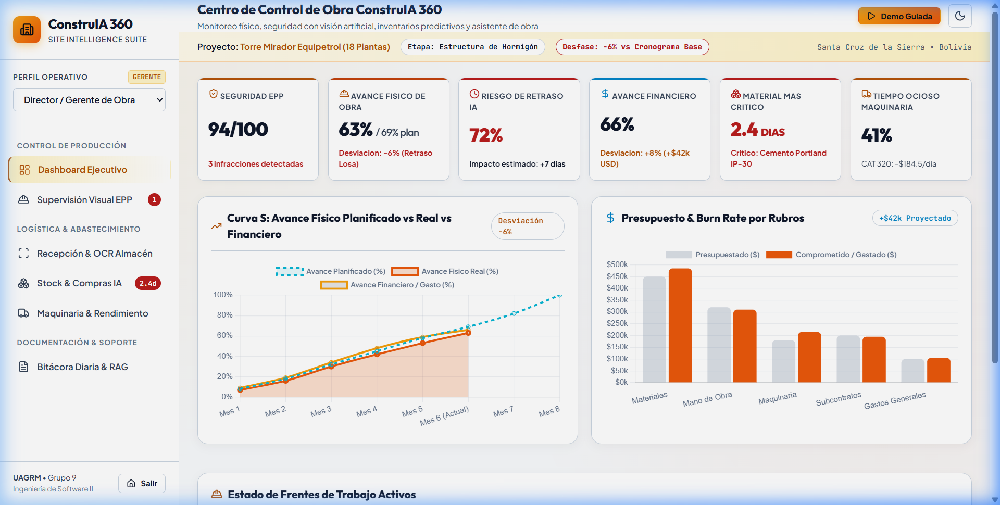
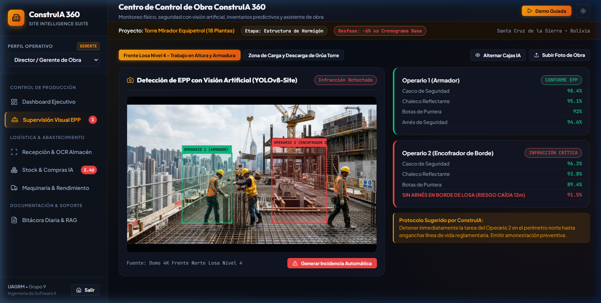
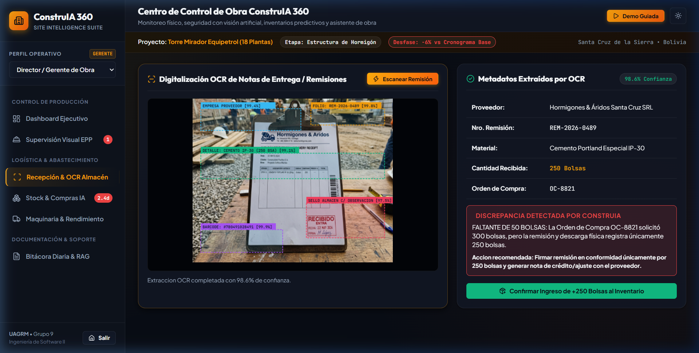
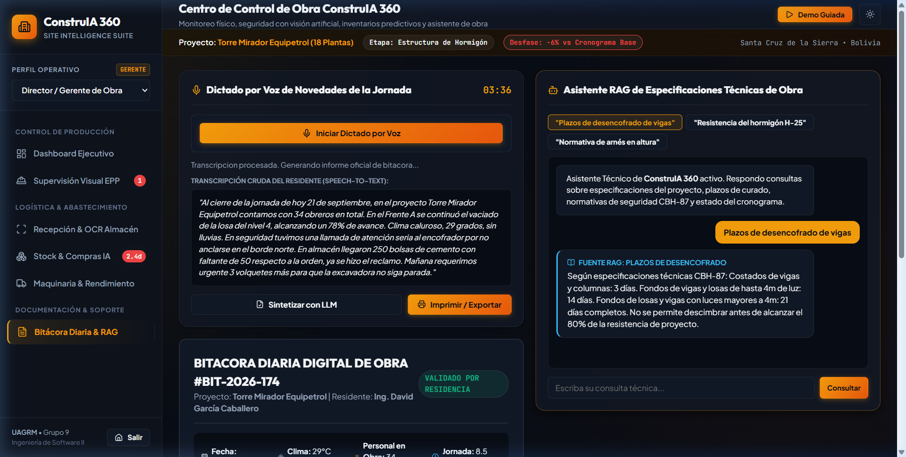

# ConstruIA 360 — Plataforma Integral de Supervisión y Control de Obras con IA

> **Caso de Estudio 2: Inteligencia Artificial Aplicada a la Construcción y Control de Obras**  
> **Universidad Autónoma Gabriel René Moreno (UAGRM)** — Facultad Integral de Ciencias de la Computación y Telecomunicaciones (FICCT)  
> **Asignatura:** Ingeniería de Software II (Grupo SB) — **Docente:** Ing. Rolando Antonio Martínez Canedo  
> **Equipo (Grupo Nº 9):** David García Caballero, José Diego García Caballero, Carlos Gabriel Lobo Gutiérrez, Leonardo Serrate Basma, Brandon Líder Vásquez Ardaya.

---

## 📌 Descripción General

**ConstruIA 360** es un prototipo interactivo de alta fidelidad para la supervisión y control técnico de obras civiles en tiempo real. 

Basado en el caso de estudio de la **Torre Mirador Equipetrol (18 Plantas)** en Santa Cruz de la Sierra, centraliza el avance físico-financiero, la seguridad laboral mediante visión artificial, la recepción de materiales con OCR, el inventario predictivo y la bitácora automatizada con modelos de lenguaje y RAG.

---

## 📸 Demostración Visual

### Panel de Control Ejecutivo 360 & Curva S (Modo Claro)
Monitoreo de avance físico real (63%) vs planificado (69%), índice de seguridad EPP (94/100), Curva S y Burn Rate presupuestario.


### Supervisión Visual de Seguridad Laboral (EPP) con YOLO HUD
Detección en tiempo real sobre fotografía de obra de cascos, chalecos reflectantes e infracciones críticas por omisión de arnés en trabajos en altura.


### Digitalización y Scanner OCR de Remisiones de Almacén
Extracción óptica de metadatos de albaranes de entrega y conciliación automática contra la orden de compra OC-8821 (alerta por faltante de 50 bolsas de cemento).


### Bitácora Diaria por Voz y Chatbot Técnico RAG
Transcripción de dictados del residente de obra, estructuración del reporte oficial `#BIT-2026-174` y asistente conversacional sobre especificaciones técnicas de hormigón H-25 y plazos de desencofrado.


---

## 🚀 5 Principales Funcionalidades de Obra

1. **Dashboard Ejecutivo 360 y Curva S Predictiva:**
   - Visualización consolidada de avance físico real (63%) frente al 69% planificado con proyección de retraso (+7 días en ruta crítica).
   - Control presupuestario interactivo (*Burn Rate*) con comparativo por rubros (materiales, mano de obra, maquinaria).

2. **Supervisión de Seguridad Laboral por Visión Artificial (EPP):**
   - Retículas tácticas con *Bounding Boxes* estilo YOLOv8 sobre fotografías reales de obra.
   - Detección de cumplimiento normativo y alerta inmediata de operarios en bordes de losa sin arnés anclado.

3. **Digitalización y Scanner OCR de Remisiones:**
   - Reconocimiento y extracción de campos clave: proveedor, folio, ítem, cantidad entregada y sellos de descarga.
   - Conciliación algorítmica contra Órdenes de Compra (OC) y actualización inmediata del inventario de obra.

4. **Predicción de Quiebre de Stock y Compras Inteligentes:**
   - Simulación de ritmo de consumo diario y alerta temprana de quiebre inminente de cemento Portland (2.4 días de autonomía).
   - Matriz multicriterio de evaluación de proveedores (precio, plazo de entrega y fiabilidad) con emisión asistida de Órdenes de Compra.

5. **Bitácora Diaria Automatizada por Voz y Asistente Técnico RAG:**
   - Dictado por voz de novedades de jornada sintetizado automáticamente en la bitácora legal estructurada.
   - Chatbot RAG (*Retrieval-Augmented Generation*) fundamentado en especificaciones técnicas de hormigón estructural (H-25) y normas de desencofrado.

---

## 🛠️ Tecnologías y Arquitectura

- **Frontend:** HTML5 semántico y CSS3 puro con sistema de diseño *Heavy-Duty Industrial Carbon* y *Safety Amber*.
- **Iconografía:** [Lucide Icons](https://lucide.dev/) vectoriales (cero emojis para rigor corporativo e industrial).
- **Visualización y Gráficos:** Chart.js para Curva S, telemetría de maquinaria y distribución presupuestaria; Canvas 2D para renderizado de visión artificial HUD y overlays de OCR.
- **Portabilidad:** Empaquetado compilado (`js/bundle.js`) para ejecución universal directa en cualquier navegador.

---

## 💻 Instrucciones de Ejecución Local

1. Clona el repositorio:
   ```bash
   git clone https://github.com/DiegoxdGarcia2/Prototipo_ConstruIA360.git
   cd Prototipo_ConstruIA360
   ```
2. Ejecuta un servidor local ligero:
   - Con Python:
     ```bash
     python -m http.server 8080
     ```
   - O abre directamente `index.html` en tu navegador favorito.
3. Abre en tu navegador:
   ```
   http://localhost:8080/index.html
   ```

---

## 🌐 Despliegue en GitHub Pages

Para publicar este prototipo en la web gratuitamente:
1. Ve a la pestaña **Settings** de este repositorio en GitHub.
2. En el menú lateral izquierdo, haz clic en **Pages**.
3. En **Build and deployment > Branch**, selecciona la rama `main` y la carpeta `/ (root)`.
4. Haz clic en **Save**. En 1-2 minutos, tu prototipo estará disponible públicamente en:
   `https://DiegoxdGarcia2.github.io/Prototipo_ConstruIA360/`
